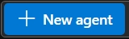

### AZF-challenge

Meu primeiro projeto de IA construído com recursos gratuitos para o AFG Challenge - AZ900.

## Introdução

Este repositório contém informações sobre a criação do Agente Papers, No **Azure AI Foundry**.

## Descrição do agente

Esse agente tem o objetivo de manipular os dados registrados em uma planilha em Excel denominada papers. Essa planilha foi obtida por meio de pesquisas em bases de dados especializadas. Os dados foram exportados no formato RIS e reunidos em um arquivo CSV. Após essa reunião eles foram exportados para uma planilha XLX.

## Objetivo do agente

O agente deve auxiliar a pessoa pesquisadora a extrair dados de forma inteligente e rápida. Embora seja possível criar filtros e tabelas dinâmicas no Excel, os metadados dessa planilha são inconsistentes, pois vieram de bases de dados diferentes (Ebsco, Dimension, Proquest dentre outras). A ideia é que o agente possa automatizar as pesquisas a essa fonte de dados.

## Passo-a-passo da Criação do Agente

Após a criação do recurso do AI Foundry na plataforma Azure, e do respectivo projeto, fomos direcionados para o AI Foundry Portal.
a) Na barra esquerda buscamos a opção <b>AGENTS</b> e clicamos no Botão   conforme a Figura 1</a>
Figura 1</a>

b) Depois que o agente é criado ao clicarmos sobre ele temos acesso ao painel de SETUP, onde a configuração é finalizada.
Os campos a seguir devem ser preenchidos:

1) Agent Name
=> Papers
Figura 2</a>
2) Deployment (antes da criação do agente deve-se passar por essa etapa)
=> gpt 4.1
3) Instructions:
=> Você deve responder questões relacionadas ao conteúdo da planilha papers. Você emails somente quando solicitado. Você não responde nenhuma outra questão sobre qualquer outro assunto.
4) Knowledge
Não utilizamos em nosso agente.
5) Actions
=> Code Interpreter Action (Figuras 3 e 4).
Optamos por esta ação pois ela manipula dados não estruturados. Devido à restrições da conta Trial, não foi possível utilizar recursos mais apropriados para essa finalidade.
Figura 3</a>
Figura 4</a>

=> Logi App Action
As figuras 5 a 9 ilustram esses passos.

Figura 5</a>

Figura 6</a>
As Figura 5 e 6 mostram a tela onde inserimos as informações básicas da Action.

Figura 7</a>
Na Figura 7 validamos a conta do outlook utilizada para envio dos e-mails.
Figura 8</a>
Na Figura 10 é validada a criação do Recurso.
Figura 9</a>
Finalmente na Figura 11 vemos o Schema gerado e podemos então finalizar a criação.

<b>Cumpridas essas etapas testamos o Agente Papers no Try Playground.</b>
Figura 10</a>
A Figura 10 mostra a primeira conversa com o agente:
Figura 11</a>
A Figura 11 mostra a sequência da conversa:
Figura 12</a>
A Figura 12 mostra a próxima sequência:
Figura 13</a>

A conversa completa pode ser consultada <a href="Attachments/Images/conversa.pdf">Aqui </a>

### Referências

