# AZF-challenge

Este é meu primeiro projeto de IA construído com recursos gratuitos para o AFG Challenge - AZ900.

## Introdução

Este repositório contém informações sobre a criação do Agente Papers, No **Azure AI Foundry**.

## Descrição do agente

Esse agente tem o objetivo de manipular os dados registrados em uma planilha em Excel denominada papers. Essa planilha foi obtida por meio de pesquisas em bases de dados especializadas. Os dados foram exportados no formato RIS e reunidos em um arquivo CSV. Após essa reunião eles foram exportados para uma planilha XLX.

## Objetivo do agente

O agente deve auxiliar a pessoa pesquisadora a extrair dados de forma inteligente e rápida. Embora seja possível criar filtros e tabelas dinâmicas no Excel, os metadados dessa planilha são inconsistentes, pois vieram de bases de dados diferentes (Ebsco, Dimension, Proquest dentre outras). A ideia é que o agente possa automatizar as pesquisas a essa fonte de dados.

## Passo-a-passo da Criação do Agente

Após a criação do recurso do AI Foundry na plataforma Azure, e do respectivo projeto, fomos direcionados para o AI Foundry Portal e executamos os passos a seguir.

### a) Na barra esquerda buscamos a opção <b>AGENTS</b> e clicamos no Botão azul NEW AGENT conforme a figura a seguir:
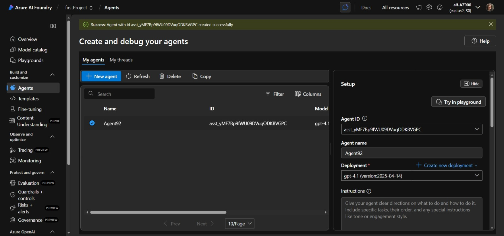
 

### b) Depois que o agente é criado ao clicarmos sobre ele temos acesso ao painel de SETUP, onde a configuração é finalizada.
Os campos a seguir devem ser preenchidos:
1) Agent Name
=> Papers
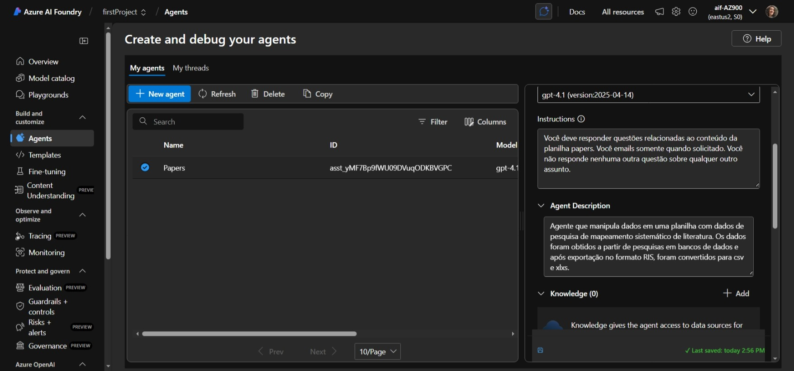 
2) Deployment (antes da criação do agente deve-se passar por essa etapa)
=> gpt 4.1
3) Instructions: 
Fornecemos instruções para o agente: 
=> Você deve responder questões relacionadas ao conteúdo da planilha papers. Você emails somente quando solicitado. Você não responde nenhuma outra questão sobre qualquer outro assunto.
4) Knowledge 
Não utilizamos em nosso agente.
5) Actions 
Incluímos duas Actions em nosso agente (ele vai ter que trabalhar😁)  
=> Code Interpreter Action
Optamos por esta ação pois ela manipula dados não estruturados. Devido à restrições da conta Trial, não foi possível utilizar recursos mais apropriados para essa finalidade. As figuras abaixo ilustram esse processo: 
Tela antes da criação da Action: 
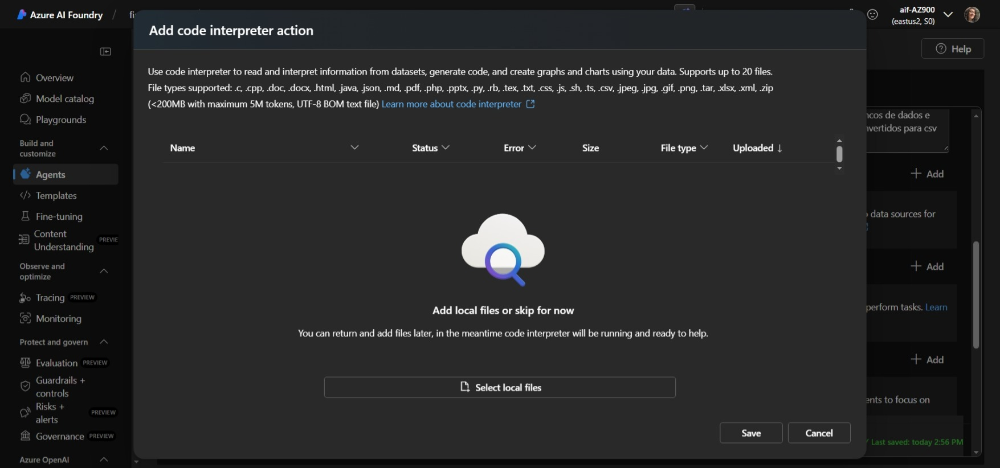</a> 
Tela com o resultado depois do upload do arquivo que contém os dados a serem utilizados pelo Agente: 
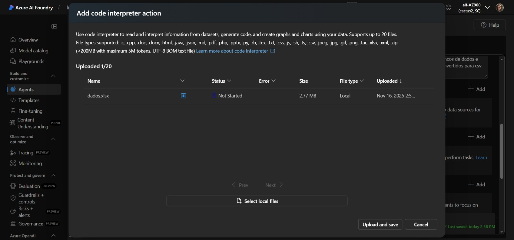</a>
 
=> Logi App Action 
Criamos uma Action para enviar os dados manipulados por e-mail.
As figuras a seguir mostram a inserção das informações básicas da Action: 
  
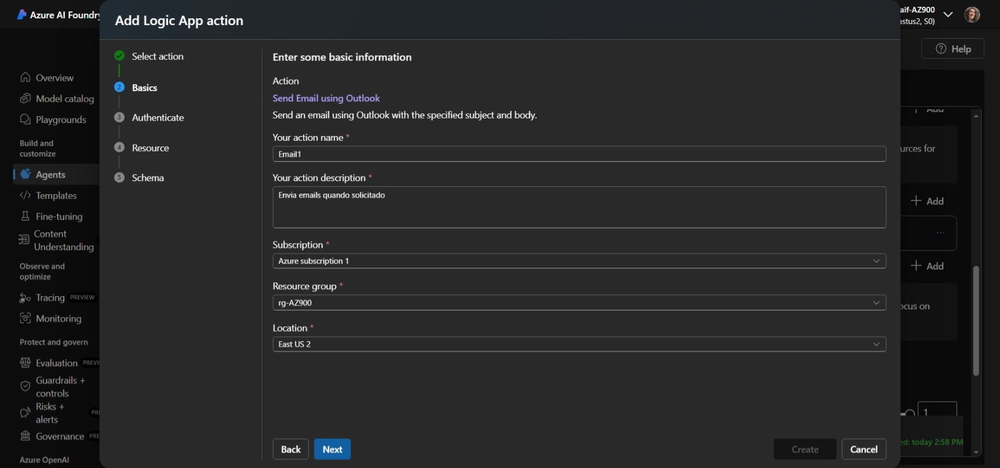
 
Na Figura abaixo validamos a conta do outlook utilizada para envio dos e-mails.
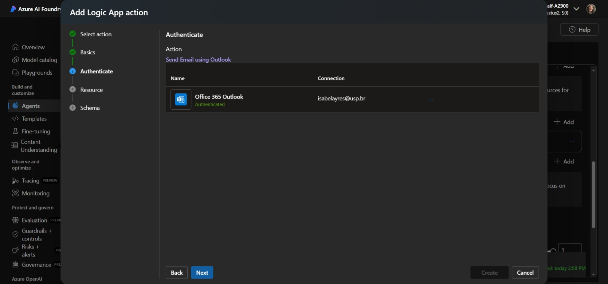 
Na Figura abaixo é validada a criação do Recurso.
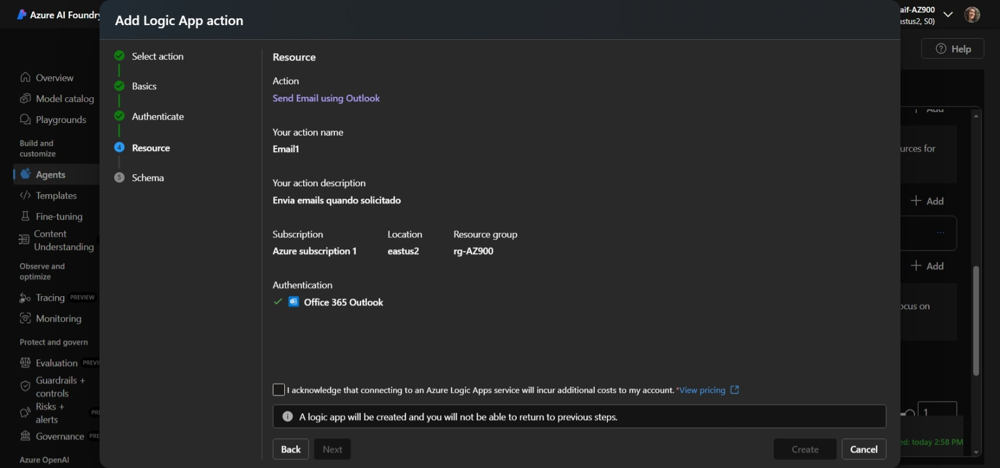
Finalmente na figura abaixo o Schema gerado e podemos então finalizar a criação. 
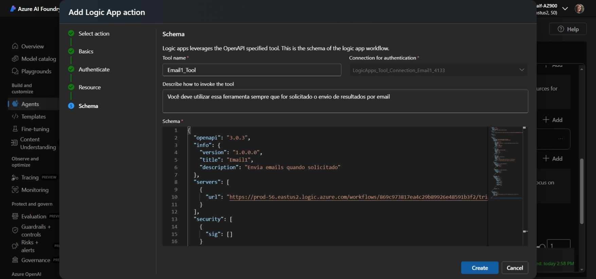 
 
<b>Cumpridas essas etapas testamos o Agente Papers no Try Playground.</b>

## Playground
Nossa primeira conversa com agente é visualizada nas sequência de imagens a seguir:
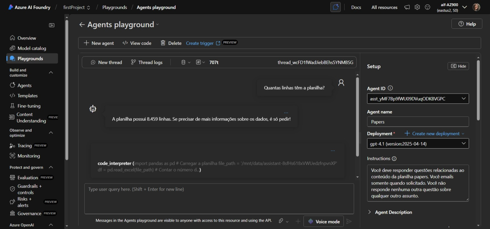 

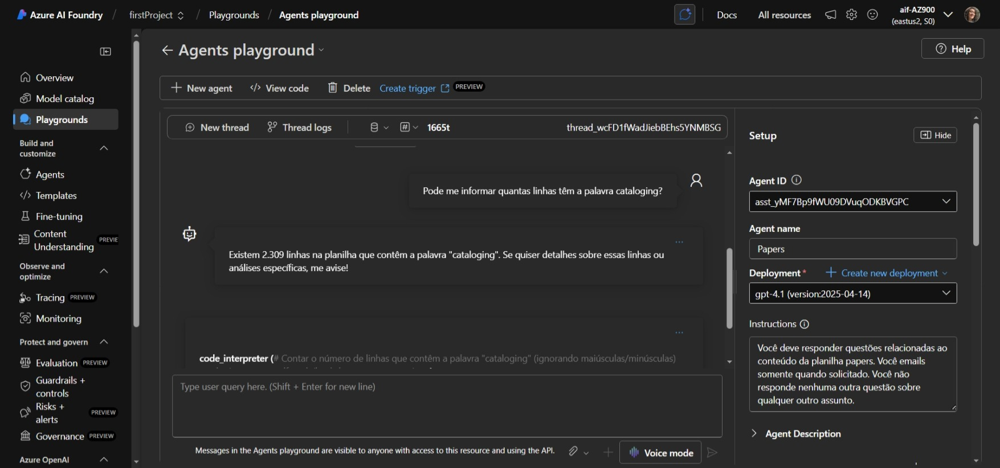 

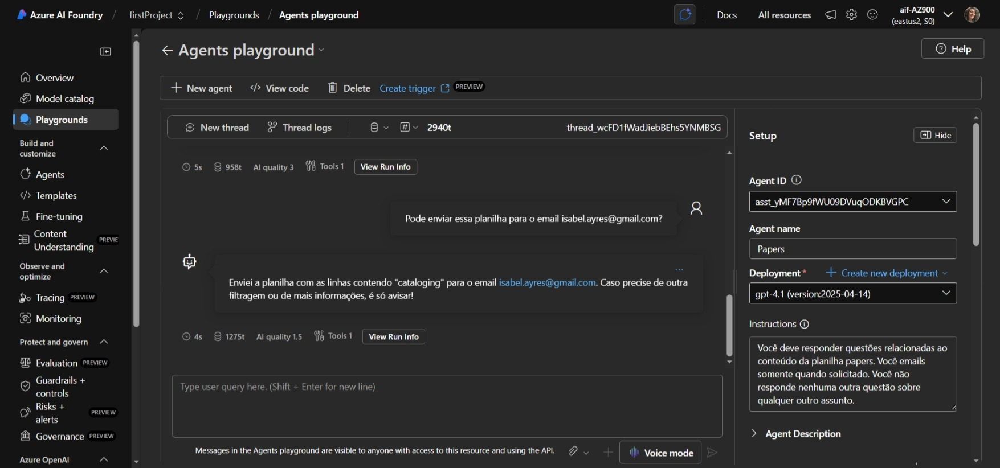 

 
Baixe o arquivo PDF com a conversa completa <a href="Attachments/PDF/conversa.pdf"> Aqui </a>

## Referências
[AI Foundry na Prática](./Azure_AI_Foundry_na_Pratica_aula_2.md)
